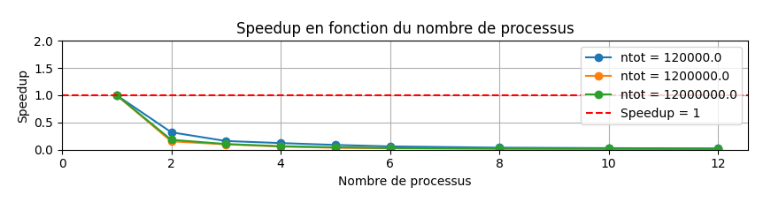
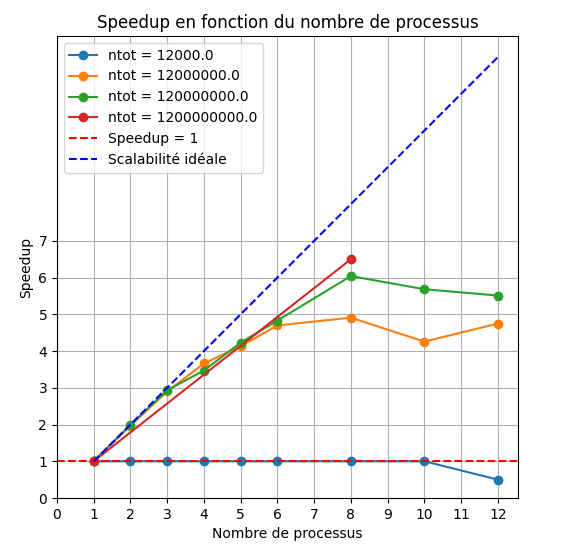

# Programmation parallèle sur machine à mémoire partagée RAPPORT 2

> GUILLERAY Victor  
> INF3FA  
> 13/12/2024

## Introduction

Ce travail pratique a pour objectif d'explorer les concepts et techniques de la 
programmation parallèle sur une architecture à mémoire partagée et une architecture
à mémoire distribuée.  
Nous avons abordé plusieurs aspects théoriques et pratiques permettant de mieux 
comprendre comment optimiser l'exécution d'un programme en exploitant le parallélisme.

Dans un premier temps, nous avons vu les différents modèles et paradigmes de 
programmation parallèle. Ensuite, nous avons mis en pratique ces notions à travers divers exercices et implémentations en Java.  
Enfin, nous avons analysé la performance des algorithmes à l'aide de métriques 
telles que l'analyse de la **scalabilité**.

Ce rapport présente donc les différents concepts abordés, les implémentations réalisées ainsi que l'analyse des performances obtenues.

## Modèles et paradigmes de programmation parallèle

### Notions fondamentales

La programmation parallèle repose sur l'exécution simultanée de plusieurs tâches afin d'améliorer les performances d'un programme. Un programme initialement séquentiel peut être converti en programme parallèle en suivant certaines méthodes et en respectant des contraintes spécifiques.

Mais attention, on sait qu'un paradigme est une structure algorithmique et qu'il ne faut ne faut donc pas mélanger modèle et paradigme.

### Suite du cours : Modèles et paradigmes de programmation parallèle

Le projet n'est pas adapté à un système en mémoire distribuée. Des modifications importantes seraient nécessaires, ce qui entraînerait plusieurs façons d'écrire le code pour répondre à divers besoins, comme différentes architectures ou qualités algorithmiques.

Comment rendre parallèle un algorithme séquentiel ?

- Analyser l'algorithme en cherchant des endroits pour paralléliser l'algo et trouver des tâches qui peuvent s'exécuter
  de manière indépendante et comment sont exprimées leurs interactions.
- On distingue deux grandes classes de modèle de programmation :
    - Parallélisme de tâche
    - Parallélisme de donnée

### Explication de monte carlo pour calculer PI

Monte carlo est une méthode de tirage aléatoire. Elle est extremement utilisé aujourd'hui et comporte beaucoup de ressource et de documentation surtout dans le domaine scientifique. Par exemple : dans des calculs avec des geophysicien pour savoir comment l'eau s'écoule dans les milieux sous terrain. On utilise la probabilité que Xp tombe dans le quart de disque.

En mot :  
((air du quart de disque)/4)/air^2

Calcul :  
P = (A_1/4 * d)/A_2 = ((pi * r^2)/4)/r^2 = pi/4 = P ou encore P ~= n_cible / n_total

Avec n_cible le nombre de flèches dans la cible et n_total le nombre de flèches tiré.

Ensuite :  
P = pi/4 ~= n_cible / n_total

Soit pi ~= 4 * n_cible / n_total

d = sqrt(xp^2 + yp^2)

si d <= 1 alors on incrémente n_cible

### Paradigmes de Programmation

- **Parallélisme de tâche** : Ce paradigme consiste à décomposer une tâche en plusieurs sous-tâches qui peuvent être exécutées en parallèle. Les sous-tâches peuvent partager des variables ou communiquer par message. Ce paradigme est adapté aux applications où les tâches peuvent être clairement définies et séparées.

- **Parallélisme de donnée** : Ce paradigme consiste à décomposer les données en plusieurs parties qui peuvent être traitées en parallèle. Chaque partie des données est traitée indépendamment, ce qui permet d'accélérer les calculs. Ce paradigme est adapté aux applications de traitement de données volumineuses.

Par exemple, les cas d'utilisation sont des tâches, car ce sont des scénarios qui en appellent d'autres, donc des tâches qui se divisent en sous tâches.

### Modèles de Programmation

1. **SISD (Single Instruction Single Data)** : Une seule instruction est exécutée sur un seul jeu de données. Ce modèle est le plus simple et est utilisé dans les systèmes où une seule tâche est exécutée à la fois. Il est principalement utilisé pour des tâches simples ne nécessitant pas de parallélisme. Il correspond surtout au ancien processeur mono coeur.

2. **SIMD (Single Instruction Multiple Data)** : Une seule instruction est exécutée sur plusieurs jeux de données. Ce modèle est typiquement utilisé dans les cartes graphiques où la même opération est appliquée à une grille de données sur plusieurs processeurs. Il est efficace pour les tâches répétitives et homogènes.

3. **MIMD (Multiple Instruction Multiple Data)** : Plusieurs instructions sont exécutées sur plusieurs jeux de données. Ce modèle est le plus flexible et est utilisé dans les systèmes où différentes tâches peuvent être exécutées simultanément. Il est adapté aux applications complexes nécessitant une grande variété de traitements. Il correspond à nos processeurs multicoeurs.

### Analyse de programme

Un code comporte deux phases principales : le calcul et l'échange de données. Les tâches peuvent se chevaucher entre le traitement des données et le calcul. Si les sous-tâches d'une boucle sont indépendantes, elles peuvent être exécutées en parallèle, ce qu'on appelle l'itération parallèle.

La méthode "diviser pour régner" est une structure algorithmique récursive qui utilise de nombreuses petites tâches pour accomplir une grande tâche.

Un pipeline est constitué de plusieurs processus exécutés en parallèle, mais chaque processus doit attendre la fin du précédent. Par exemple, laver le linge, le sécher, le repasser et le plier, chacun dans l'ordre.

## Implémentations Pratiques

### TP 4 : Réorganisation des Fichiers et Classes

Nous avons utilisé le code de Karthik Jain et Steve Kaultz pour Assignement 102 et Pi. Ensuite nous avons réorganisé les fichiers et classes en plusieurs fichiers pour améliorer la structure du code. Cette réorganisation a permis de clarifier les responsabilités de chaque classe et de faciliter la maintenance du code. La modularité du code a été améliorée, ce qui est essentiel pour le développement de programmes parallèles.

### Assignement 102

Le code d'Assignement 102 utilise l'API concurrent l'appelation nAtomSuccess correspond au n_cible habituel.

Une tache monte carlo est une iteration de notre boucle, le code utilise le paradigme des iterations parallèles.

Il fonctionne en créant des taches de monte carlo et en les attribuants à un thread.

Cependant le programme passe trop de temps dans la section critique, on peut tout de même accelerer un peu en disant les fleches qui tombent hors de la cible au lieu de dedans. On passe de 75% des flèches tombées environ à 25% donc 50% de flèche en moins à traiter.

Malheureusement l'acceleration reste minimal et n'augmente pas suffisamment les performances.

Assignement 102 utilise le vole de tache car il peut être adapter dans ce contexte cependant il passe beaucoup de temps dans les communications d'où la lenteur de ce programme.

Le programme à un nombre de tâche correspondant au nombre de flêche, puis le système les séparent en un nombre P de processus. En assignant les taches au processus, cela prends beaucoup de temps quand on met une grande quantité de fleche.

### Pour PI 
Le programme Pi utilise ArrayList, List et random de la classe Util (pas de math).

La class Pi avec la method main permet d'instancier Master et execute doRun. Cette méthode dépend de la classe Master.
La méthode doRun permet d'executer avec un certain nombre de flèche ici total count à divise en plusieurs processus qui est numworkers. Pour determiner le temps d'execution on a starttime et stoptime.

On crée tasks qui est la liste des taches qui seront effectuées, en respectant le paradigme choisi chaque tache est un worker. Les worker sont des Callable qui sont des Runnable qui renvoie un resultat qui est ajouté dans une liste qui est une Future.

## Analyse des codes

On peut retrouver les diagrammes de classes des codes réalisés dans le dossier conception.

Les Future sont des objets de l'API Concurrent qui stockent les résultats tout en protégeant les données lors d'un accès parallèle. Ils sont appelés Future pour leur nature asynchrone, mais nécessitent une synchronisation pour résoudre les dépendances entre les tâches. Cela se fait lorsque le résultat d'une tâche est connu, permettant de récupérer les données avant de poursuivre le programme.

Les Future sont enchaînés dans une liste et récupérés dès qu'ils arrivent, débloquant ainsi les dépendances.

Dans un modèle master-worker Monte Carlo, les travailleurs (workers) renvoient les résultats sous forme de Future à un instant donné. Ces résultats sont ensuite ajoutés à une liste pour être traités (réduction).

Comment le modèle maître-esclave est-il implémenté ici ?

L'opération atomique (atomic integer) utilise un moniteur pour protéger un entier lors de l'incrémentation, qui est une section critique. Le moniteur est atomique et offre des points d'entrée comme incrementAndGet pour garantir la sécurité des opérations concurrentes.

Pour réaliser des programmes en mémoire partagée on peut aussi utiliser OpenMP.

## Analyse de la scalabilité

### Le speedup

L’accélération d’un programme parallèle (ou speedup) représente le gain en rapidité d’exécution obtenu par son exécution sur plusieurs processeurs.

On l'obtient de la manière suivante : 

Temps d'execution :  
T1 = ntot * ti  
Tp = ntot/p * ti  
Sp = T1/Tp  

Avec T1 le temps d'exécution mesurer avec 1 processus, Tp le temps mesuré avec p processus, Sp le speedup calculé, ntot le nombre de flèche dans la cible, p le nombre de processus et ti qui peut être interprété par le temps pour 1 flèche/tache executé.

Les temps sont souvent la moyenne ou la median des valeurs obtenues de temps sur plusieurs expériences avec le même ntot et le même p.

Cela nous permet de penser que l'on va aller p fois plus vite à chaque fois. Cela correspond à la scalabilité forte.

Cependant, si Tp > T1 alors Sp < 1 indiquant une perte de performance. Si on réduit la zone cible à un quart, remplaçant 3/4 par 1/4 (donc exterieur de la cible), Tp < T1 et Sp > 1, ce qui montre une amélioration des performances.

*Figure: Speedup (extrait du cours F. Butelle et C. Coti, U. P13, https://lipn.univ-paris13.fr/~coti/cours/coursmpi1.pdf*

Le speedup super-linéaire se produit uniquement lorsque la charge processeur est excessivement élevée en mode séquentiel.
Le speedup linéaire se produit lorsque le parallèlisme est optimal.
Et un speedup sub-linéaire se produit dans le cas courant suite au ralentissement dû au parallèlisme. Aussi appelé le typical success.

Exemple simple : 
Un processeur doit récupérer des informations d'un tableau en RAM. Si le tableau est petit, il est chargé dans le cache, permettant un traitement rapide. Cependant, si le tableau est très grand, il doit être divisé en morceaux, chacun étant chargé tour à tour dans le cache et la RAM pour être traité. Ce processus implique des allers-retours entre le cache et la RAM, ce qui prend du temps.

L'avantage des travailleurs (workers) est qu'ils peuvent chacun traiter un morceau du tableau qui tient entièrement dans leur cache, réduisant ainsi les allers-retours et améliorant l'efficacité.

Nous allons voir 2 types de scalabilité :

Scalabilité forte :  
On fixe la taille du problème et on augmente le nombre de processus

Scalabilité faible :  
On fixe la taille du problème par processus et on augmente le nombre de
processus. C’est à dire, la taille du problème augmente avec le nombre de
processus.

### Consignes :

1) executer les codes -  assignement 102 et pi et passer les parametres d'entrée (A102 : ntot et nb processor;
Pi : ntot/p et p = nbworker) 
2) s'assurer qu'on peut traiter les infos de ces codes - avoir les meme sorties pour les 2 codes (avoir les meme print)
erreur piapproc - piexact / piexact ; ntot ; nb process; temps exec ; 
+ recommendation : print des sorties dans un fichier avec append (out_ass102 et out_pi_salle_4ou8c(oeur)).txt
3) speedup grossier, est ce que le code se comporte comme attendu ; voir l'evolution du temps au fur et a mesure

Le nombre de processus et le nombre de flèches et gérée automatiquement à l'aide de boucle.

Voir les txt out.txt

### Resume : 
#### Sur architecture a memoire partage
Programmation Parallèle et Distribuée :
Concurrence et gestion des threads.
Architecture de mémoire partagée.
Utilisation de Java Threads.
Méthode de Monte Carlo avec l'API Concurrent : modèle et paradigme de programmation parallèle.
Limitation : Impossible d'avoir plus de cœurs physiques ou logiques que ceux disponibles sur une machine.
Solution : Augmenter les ressources physiques en utilisant d'autres machines.

#### Sur architecture a memoire distribue
Utilisation des Sockets Java :
Communication entre plusieurs machines pour répartir la charge de travail et les données.

Les sockets sont des interfaces de communication bidirectionnelle permettant l'échange de données entre processus sur un même ordinateur ou sur un réseau. Ils utilisent le modèle client-serveur, où le serveur écoute les connexions entrantes et le client initie la communication. Les sockets peuvent être configurés pour des protocoles comme TCP (connexion fiable) ou UDP (connexion sans établissement). En Java, la classe Socket est utilisée pour créer des sockets clients, tandis que ServerSocket gère les connexions serveur. Les sockets sont essentiels pour les applications réseau, telles que les navigateurs web et les services de messagerie.

Pour lancer plusieurs travailleurs (workers), cochez la case "Allow multiple instances". Vous pouvez spécifier un argument pour leur exécution en indiquant le port d'écoute de chaque travailleur.

Pour le maître (master), exécutez-le en fournissant le nombre de machines et les ports des machines.

## Evaluation de la performance

Courbe Bleue (ntot = 120,000,000) et Courbe Orange (ntot = 1,200,000,000) :
Le speedup commence à environ 1 avec un seul processus, ce qui est attendu.
Le speedup baisse doucement initialement avec l'ajout de processus, mais commence à diminuer drastiquement après environ 4 processus.
Cela indique que l'ajout de processus supplémentaires ne contribue pas à une amélioration significative des performances, probablement en raison de la surcharge de gestion des processus ou des limitations de la parallélisation mais surtout car cette algorithme n'est pas fait pour être parallèlisé de cette manière ou que la parallèlisation est mal réalisé.

Les deux courbes sont bien en dessous de la ligne de scalabilité idéale, ce qui montre que le système ne tire pas pleinement parti de l'ajout de processus supplémentaires.

Toutes les courbes montrent un speedup initial qui diminue rapidement à mesure que le nombre de processus augmente.
Le speedup commence autour de 1 pour un processus et chute en dessous de 1 au-delà de 2 processus.

La scalabilité faible est testée ici en augmentant à la fois le nombre de processus et la taille du problème.
Le fait que le speedup soit inférieur à 1 pour plus de 2 processus indique que l'ajout de processus supplémentaires ne compense pas l'augmentation de la charge de travail. Cela peut être dû à des surcharges de communication ou de gestion des processus.

La ligne rouge pointillée montre un speedup de 1, ce qui est le minimum attendu pour une performance stable. Les courbes étant en dessous de cette ligne montrent que l'efficacité diminue avec l'ajout de processus.

Courbe Bleue (ntot = 12,000) :  
Le speedup reste proche de 1 pour tous les nombres de processus, indiquant qu'il n'y a pratiquement pas de gain de performance avec l'ajout de processus supplémentaires. Cela suggère que le problème est trop petit pour bénéficier de la parallélisation. Il était inutile de la faire.

Courbe Orange (ntot = 120,000,000) et Courbe Verte (ntot = 1,200,000,000) :
Le speedup augmente initialement avec l'ajout de processus, atteignant un pic autour de 6 processus, puis diminue légèrement. Cela montre que l'ajout de processus est bénéfique jusqu'à un certain point, après quoi les gains de performance diminuent. La courbe suit d'ailleurs le typical success de la scalabilité. Le fait d'avoir parallèlisé accélère bien l'execution du programme.

Ne pas tenir compte de la courbe rouge.

Cette analyse montre que la taille du problème (ntot) influence fortement le speedup obtenu avec l'ajout de processus. Pour les problèmes plus grands, l'ajout de processus améliore significativement les performances jusqu'à un certain point, après quoi les gains diminuent. Pour les problèmes plus petits, l'ajout de processus ne conduit pas à des gains de performance significatifs. Cela souligne l'importance de choisir le bon niveau de parallélisation en fonction de la taille du problème. On peut interpréter que les 4 vrais coeurs du processeur correspondent à 4 vrais coeurs mais que 8 coeurs multi threadé correspondent plus à 6 vrais coeurs.

Les trois courbes (bleue, orange, verte) montrent un speedup proche de 1 pour tous les nombres de processus jusqu'à la limite du processeur de 8 coeurs. Cela signifie que le temps d'exécution reste constant lorsque le nombre de processus et la taille du problème augmentent proportionnellement.
Cela est typique de la scalabilité faible, où l'objectif est de maintenir le temps d'exécution constant en augmentant les ressources proportionnellement à la charge de travail.

## Reutilisation de composant logiciel

Nous argumentons en faveur de la réutilisation de pi.java en nous basant sur les expériences précédentes.

On intègre la méthode de Monte Carlo de pi.java dans une architecture master-worker pour appeler le code efficacement.

On commence avec quatre workers, chacun exécutant un thread pi.java (classe Master) sur l'un des quatre cœurs disponibles. Par la suite, on configure un seul worker avec quatre threads pi.java pour optimiser l'utilisation des ressources.

### Consignes de tp : 
1) Validation MC avec javasocket
2) Conception integrer pi.java dans worker socket
3) Validation 
4) Scalabilité sur 1 poste
5) Mise en oeuvre sur N postes

### Critères de Qualité et Réutilisation de Composants
La réutilisation de composants, telle que celle de pi.java, est un critère de qualité important dans le développement logiciel. Elle permet de tirer parti des expériences précédentes et d'assurer une cohérence dans le code.

### Analyse des Performances
L'écart observé entre la courbe de scalabilité idéale et les courbes obtenues avec l'architecture maître-esclave (MWS) est principalement dû à la latence du réseau. Cette latence introduit des délais qui ne sont pas présents dans un environnement local, ce qui affecte les performances globales du système.

En revanche, pour l'architecture maître-esclave utilisant pi.java, les raisons de l'écart ne sont pas liées à la latence réseau, mais plutôt à d'autres facteurs internes, tels que la gestion des threads et la synchronisation des tâches.

### Execution distribuée

On utilise CentOS car Windows bloque les communications entre les machines.

Installation de java-devel pour avoir l'environnement de développement Java.

On désactive le pare-feu de CentOS avec la commande : sudo systemctl stop firewalld.

On lance les workers sur les machines désirées.

On execute le master en spécifiant les adresses IP des workers.

## Mesures de Scalabilité dans la Norme IEC 25010

La scalabilité d'un code parallèle est un critère essentiel de qualité, tel que défini dans la norme IEC 25010. Elle permet d'évaluer la capacité d'un système à gérer une augmentation de la charge de travail ou de la taille des données de manière efficace. Pour un code parallèle, cela signifie que le système doit pouvoir s'adapter à l'ajout de plus de processeurs ou de cœurs de calcul tout en maintenant ou en améliorant ses performances.

### Métriques Utilisées
- **Temps d'Exécution** : Mesure le temps nécessaire pour exécuter une tâche donnée. Il est crucial pour évaluer l'efficacité d'un algorithme parallèle.
- **Speedup** : Indique dans quelle mesure l'ajout de ressources supplémentaires (comme des processeurs) réduit le temps d'exécution. Un speedup idéal est linéaire, signifiant que doubler les ressources divise par deux le temps d'exécution.

### Analyse de l'Erreur de Pi
Pour évaluer la précision des calculs, nous avons tracé l'erreur de la valeur de Pi en fonction du nombre de cibles (n_tot). L'erreur est calculée comme la différence entre la valeur estimée de Pi et sa valeur exacte. Les résultats sont présentés sur une échelle logarithmique pour mieux visualiser les variations.

### Effectiveness et Efficiency selon la Norme IEC 25022
La norme IEC 25022 distingue deux concepts clés :

- **Effectiveness** : Mesure dans quelle mesure un système atteint ses objectifs ou répond aux exigences des utilisateurs.
- **Efficiency** : Évalue l'utilisation des ressources par le système pour atteindre ses objectifs.
- 
Calcul de l'Efficacité Parallèle  :

L'efficacité parallèle peut être calculée par la formule :

Efficacité = Tchap - Tp / Tchap

temps cible / temps calculer
Tchap / Tp = 0,5 / 0.75 = 1/2 * 4/3 = 2/3
exemple : si T1 = 1sec alors T2 = 0.5sec

On peut donc savoir à combien de pourcent nous sommes parallèles.

Résultats Obtenus
Les métriques mesurées, telles que le temps d'exécution et le speedup, correspondent bien aux courbes de speedup attendues. Cela indique que les améliorations apportées au code parallèle ont un impact positif sur la performance.

Analyse Finale
Les résultats montrent que les métriques choisies sont appropriées pour évaluer la scalabilité et l'efficacité du code parallèle selon les normes IEC 25010 et 25022. Les courbes de speedup et les boxplots des erreurs confirment que les optimisations apportées améliorent effectivement les performances. En termes d'efficacité et d'effectiveness, les deux métriques sont complémentaires : l'efficacité mesure l'utilisation optimale des ressources, tandis que l'effectiveness évalue la capacité du système à atteindre ses objectifs.

En conclusion, les mesures effectuées démontrent que le code parallèle est bien optimisé pour la scalabilité et l'efficacité, répondant ainsi aux critères de qualité définis par les normes IEC. Ce qu'on calcul donne donc le bon résultat jusqu'à 10e-6.

## Conclusion

Ce TP a permis d'explorer la programmation parallèle et ses implications sur la performance des algorithmes.  
Nous avons vu que la parallélisation n'apporte pas toujours une amélioration linéaire et que des facteurs comme la synchronisation ou la communication entre threads influencent fortement les résultats.

NB : j'ai utilisé l'IA pour rédiger et reformuler certaines de mes notes.
